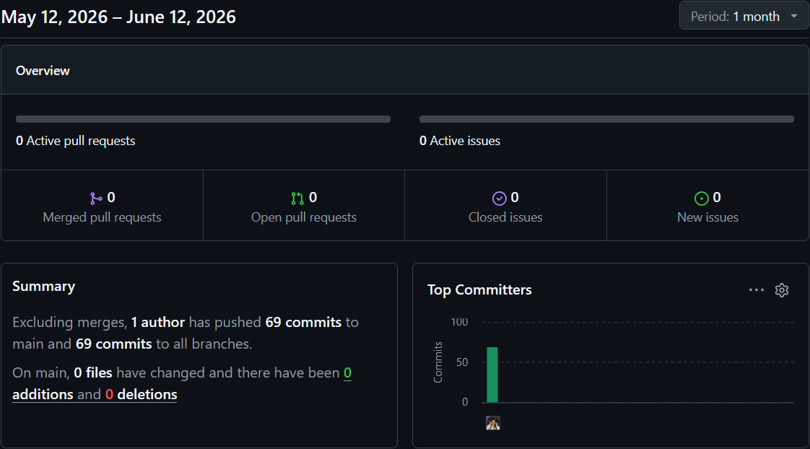
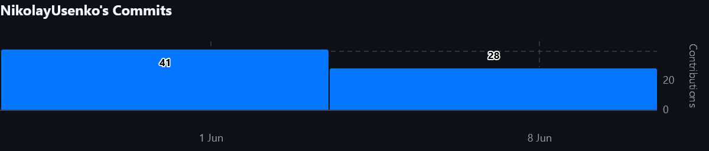

# KeyType — Онлайн-тренажёр клавиатурной печати

Курсовой проект по дисциплине «Технология разработки программного обеспечения»  
Траектория В: Django REST + React SPA + AJAX + JWT + WebSocket

---

## Содержание

1. [О проекте](#1-о-проекте)
2. [Технологический стек](#2-технологический-стек)
3. [Структура репозитория](#3-структура-репозитория)
4. [Требования к окружению](#4-требования-к-окружению)
5. [Установка и настройка Backend](#5-установка-и-настройка-backend)
6. [Установка и настройка Frontend](#6-установка-и-настройка-frontend)
7. [Запуск приложения](#7-запуск-приложения)
8. [Переменные окружения](#8-переменные-окружения)
9. [API — эндпоинты и документация](#9-api--эндпоинты-и-документация)
10. [Функциональность](#10-функциональность)
11. [Механика печати](#11-механика-печати)
12. [Администрирование](#12-администрирование)
13. [Тестирование](#13-тестирование)
14. [Статистика разработки](#14-статистика-разработки)

---

## 1. О проекте

**KeyType** — веб-приложение для тренировки скорости и точности клавиатурной печати.  
Поддерживает два режима работы:

- **Тест** — набор случайно сгенерированных слов на английском или русском языке.
- **Уроки** — отработка конкретных комбинаций клавиш по заданным текстам.

Авторизованные пользователи получают доступ к накапливаемой личной статистике.  
При установке нового рекорда WPM приложение мгновенно уведомляет пользователя через WebSocket.

---

## 2. Технологический стек

### Backend
| Компонент | Технология |
|---|---|
| Язык | Python 3.12 |
| Фреймворк | Django 5.0 + Django REST Framework 3.15 |
| Аутентификация | JWT (djangorestframework-simplejwt) |
| WebSocket | Django Channels 4.1 + Daphne 4.1 |
| База данных | SQLite (разработка) |
| CORS | django-cors-headers |

### Frontend
| Компонент | Технология |
|---|---|
| Язык | JavaScript (ES2022) + JSX |
| Фреймворк | React 18 |
| Маршрутизация | React Router 6 |
| HTTP-клиент | Axios (с JWT-интерцепторами) |
| Кэширование | TanStack React Query 5 |
| Сборщик | Create React App |

---

## 3. Структура репозитория

```
course-project/
├── backend/                    # Django REST API + Channels
│   ├── config/
│   │   ├── __init__.py
│   │   ├── settings.py
│   │   ├── urls.py
│   │   ├── asgi.py             # ASGI + WebSocket
│   │   ├── wsgi.py
│   │   └── routing.py          # WebSocket маршруты
│   ├── core/                   # Основное приложение
│   │   ├── models.py           # Lesson, TestResult
│   │   ├── serializers.py
│   │   ├── views.py
│   │   ├── urls.py
│   │   ├── admin.py            # CRUD уроков с валидацией
│   │   ├── consumers.py        # WebSocket consumer
│   │   ├── permissions.py
│   │   ├── tests.py
│   │   └── fixtures/
│   │       └── initial_lessons.json
│   ├── users/                  # Аутентификация и профиль
│   │   ├── models.py           # Расширенная модель User
│   │   ├── serializers.py
│   │   ├── views.py
│   │   ├── urls.py
│   │   ├── admin.py
│   │   └── tests.py
│   ├── manage.py
│   ├── requirements.txt
│   └── .env.example
│
├── frontend/                   # React SPA
│   ├── public/
│   │   └── index.html
│   ├── src/
│   │   ├── components/
│   │   │   ├── Keyboard.jsx        # Визуализация клавиатуры
│   │   │   ├── Keyboard.test.jsx
│   │   │   ├── Navbar.jsx
│   │   │   ├── Notification.jsx    # Real-time уведомления
│   │   │   ├── Notification.test.jsx
│   │   │   ├── ProtectedRoute.jsx
│   │   │   ├── TestResultModal.jsx
│   │   │   └── LessonResultModal.jsx
│   │   ├── contexts/
│   │   │   └── AuthContext.jsx     # JWT-аутентификация
│   │   ├── hooks/
│   │   │   ├── useTypingTest.js    # Логика теста
│   │   │   ├── useTypingTest.test.js
│   │   │   ├── useLessonTyping.js  # Логика урока
│   │   │   ├── useLessonTyping.test.js
│   │   │   └── useWebSocket.js     # WebSocket-подписка
│   │   ├── pages/
│   │   │   ├── TestPage.jsx
│   │   │   ├── LessonsPage.jsx
│   │   │   ├── LessonPracticePage.jsx
│   │   │   ├── StatsPage.jsx
│   │   │   ├── LoginPage.jsx
│   │   │   └── RegisterPage.jsx
│   │   ├── services/
│   │   │   ├── api.js              # Axios + auto-refresh токенов
│   │   │   └── websocket.js        # WebSocket-сервис
│   │   ├── utils/
│   │   │   └── wordGenerator.js    # Генерация слов EN/RU
│   │   ├── App.jsx
│   │   ├── App.css
│   │   ├── index.js
│   │   └── index.css
│   ├── package.json
│   └── .env.example
│
└── README.md
```

---

## 4. Требования к окружению

| Инструмент | Версия |
|---|---|
| Python | ≥ 3.11 |
| Node.js | ≥ 18.0 |
| npm | ≥ 9.0 |
| Git | ≥ 2.40 |

---

## 5. Установка и настройка Backend

### 5.1. Клонирование репозитория

```bash
git clone https://github.com/NikolayUsenko/fourth-term-course-project
cd course-project/backend
```

### 5.2. Виртуальное окружение

```bash
# Создание
python -m venv venv

# Активация (Windows)
venv\Scripts\activate

# Активация (Linux / macOS)
source venv/bin/activate
```

### 5.3. Установка зависимостей

```bash
pip install -r requirements.txt
```

**`requirements.txt`:**
```
django==5.0.6
djangorestframework==3.15.2
djangorestframework-simplejwt==5.3.1
django-cors-headers==4.4.0
channels==4.1.0
daphne==4.1.2
python-dotenv==1.0.1
Pillow==10.4.0
```

### 5.4. Переменные окружения

```bash
cp .env.example .env
# Отредактировать .env (см. раздел 8)
```

### 5.5. Миграции и начальные данные

```bash
python manage.py makemigrations users
python manage.py makemigrations core
python manage.py migrate

# Создание суперпользователя (администратора)
python manage.py createsuperuser

# Загрузка начальных уроков
python manage.py loaddata core/fixtures/initial_lessons.json
```

### 5.6. Запуск тестов

```bash
python manage.py test
```

---

## 6. Установка и настройка Frontend

### 6.1. Переход в директорию

```bash
cd course-project/frontend
```

### 6.2. Установка зависимостей

```bash
npm install
```

### 6.3. Переменные окружения

```bash
cp .env.example .env
# Отредактировать .env (см. раздел 8)
```

---

## 7. Запуск приложения

### Backend

WebSocket требует ASGI-сервера. Используйте **Daphne**:

```bash
cd course-project/backend

# Активировать venv, затем:
daphne -p 8000 config.asgi:application
```

> Альтернативно (только HTTP, без WebSocket):
> ```bash
> python manage.py runserver
> ```

### Frontend

```bash
cd course-project/frontend
npm start
```

Приложение откроется по адресу **http://localhost:3000**  
Backend доступен по адресу **http://localhost:8000**  
Django Admin — **http://localhost:8000/admin/**

---

## 8. Переменные окружения

### `backend/.env`

```env
SECRET_KEY=django-insecure-your-secret-key-here-change-in-production
DEBUG=True
ALLOWED_HOSTS=localhost,127.0.0.1

# JWT
JWT_ACCESS_TOKEN_LIFETIME=30       # минуты
JWT_REFRESH_TOKEN_LIFETIME=1440    # минуты (1 сутки)

# CORS
CORS_ALLOWED_ORIGINS=http://localhost:3000,http://127.0.0.1:3000
```

### `frontend/.env`

```env
REACT_APP_API_URL=http://localhost:8000/api
REACT_APP_WS_URL=ws://localhost:8000
```

---

## 9. API — эндпоинты и документация

### Аутентификация (`/api/auth/`)

| Метод | Эндпоинт | Доступ | Описание |
|---|---|---|---|
| POST | `/api/auth/register/` | Все | Регистрация |
| POST | `/api/auth/login/` | Все | Получение JWT access/refresh |
| POST | `/api/auth/token/refresh/` | Все | Обновление access-токена |
| POST | `/api/auth/logout/` | Авторизован | Инвалидация refresh-токена |
| GET | `/api/auth/profile/` | Авторизован | Профиль пользователя |
| PUT/PATCH | `/api/auth/profile/` | Авторизован | Обновление профиля |

### Уроки (`/api/lessons/`)

| Метод | Эндпоинт | Доступ | Описание |
|---|---|---|---|
| GET | `/api/lessons/` | Все | Список уроков |
| GET | `/api/lessons/?language=en` | Все | Фильтр по языку (en/ru) |
| GET | `/api/lessons/{id}/` | Все | Детали урока |
| POST | `/api/lessons/` | Администратор | Создать урок |
| PUT/PATCH | `/api/lessons/{id}/` | Администратор | Изменить урок |
| DELETE | `/api/lessons/{id}/` | Администратор | Удалить урок |

### Результаты тестов (`/api/results/`)

| Метод | Эндпоинт | Доступ | Описание |
|---|---|---|---|
| POST | `/api/results/` | Авторизован | Сохранить результат теста |
| GET | `/api/results/` | Авторизован | История своих результатов |

### Статистика

| Метод | Эндпоинт | Доступ | Описание |
|---|---|---|---|
| GET | `/api/stats/` | Авторизован | Агрегированная статистика пользователя |
| GET | `/api/admin/stats/` | Администратор | Статистика всех пользователей |

### WebSocket

| URL | Описание |
|---|---|
| `ws://localhost:8000/ws/notifications/?token=<access_token>` | Real-time уведомления о рекордах WPM |

**Формат сообщения:**
```json
{
  "type": "new_record",
  "data": {
    "wpm": 75.3,
    "language": "en",
    "word_count": 25,
    "previous_best": 70.1
  }
}
```

### API Документация
После запуска сервера интерактивная документация доступна по адресам:

| URL | Описание |
|---|---|
| `http://localhost:8000/api/docs/` | **Swagger UI** — тестирование эндпоинтов |
| `http://localhost:8000/api/redoc/` | **ReDoc** — читаемая документация |
| `http://localhost:8000/api/schema/` | OpenAPI схема (YAML) |
| `http://localhost:8000/admin/` | Django Admin |

---

## 10. Функциональность

### Неавторизованный пользователь

**Страница теста:**
- Выбор языка: английский или русский
- Выбор количества слов: 10, 25, 50 или 100
- Слова генерируются на фронтенде, все строчные
- Визуализация клавиатуры QWERTY / ЙЦУКЕН с подсветкой следующей клавиши
- По завершении — модальное окно со статистикой: WPM, CPM, точность, длительность (HH:MM:SS), тип теста
- Предложение зарегистрироваться для сохранения статистики
- Кнопка «↺ Restart»

**Страница уроков:**
- Выбор языка: английский или русский
- Список уроков с комбинацией клавиш
- Практика конкретных комбинаций по заданному тексту
- Визуализация клавиатуры с подсветкой следующей клавиши
- По завершении — модальное окно: CPM, точность, длительность (HH:MM:SS), язык, комбинация клавиш
- Кнопки: «Next →», «↺ Retry», «All Lessons»

### Авторизованный пользователь

- Все возможности неавторизованного пользователя
- Результаты тестов автоматически сохраняются в базе данных
- Страница статистики `/stats`:
  - Общее количество тестов
  - Суммарное время печати (HH:MM:SS)
  - Средние WPM, CPM, точность
  - Таблица по языкам (EN / RU): средний WPM и точность для каждого из 4 количеств слов
- Real-time уведомление при установке нового рекорда WPM

### Администратор

- CRUD уроков через Django Admin с валидацией
- Просмотр статистики всех пользователей

---

## 11. Механика печати

| Правило | Описание |
|---|---|
| Направление | Только вперёд — клавиша Backspace не обрабатывается |
| Завершение | Тест / урок завершается только при нажатии пробела **после последнего слова** |
| Точность | Keystroke-уровень: правильные нажатия / все нажатия × 100% |
| WPM | Полностью верно набранные слова / время в минутах |
| CPM | Правильные нажатия / время в минутах |
| Tab / Escape | Перезапуск теста или урока |

---

## 12. Администрирование

Django Admin доступен по адресу `/admin/`.

### Создание урока

При добавлении или редактировании урока проверяется:

| Поле | Правило |
|---|---|
| **Язык** | English или Russian |
| **Комбинация клавиш** | Только a-z (EN) или а-я/ё (RU); без пробелов и знаков препинания |
| **Содержание** | Только буквы соответствующего языка и одиночные пробелы между словами; знаки препинания запрещены |

**Пример урока:**
```
Язык:              English
Название:          Home Row — asdf
Комбинация клавиш: asdf
Содержание:        asdf asdf fads sad dad add fad ads
```

### Начальные данные

После `loaddata` загружаются 13 уроков: 7 для английского (home row, top row, bottom row) и 6 для русского (домашний ряд, верхний ряд, нижний ряд).

---

## 13. Тестирование

```bash
# Backend — запуск всех тестов
cd backend
python manage.py test

# Тесты конкретного приложения
python manage.py test core
python manage.py test users

# Frontend — запуск всех тестов
cd frontend
npm test
```

## 14. Статистика разработки

- **Всего коммитов:** 69
- **Период разработки:** июнь 2026
- **Средняя частота:** 6.3 коммитов/день

### График активности



### Тепловая карта



---
---
Проект выполнен в рамках дисциплины "Технология разработки программного обеспечения"
